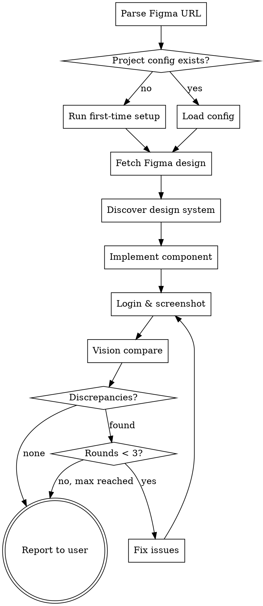

# Figma Match

## Overview

Implement Figma designs with an automated visual verification loop. Fetches design via Figma MCP, implements using the project's design system, then screenshots the running app with Playwright and self-compares — fixing discrepancies for up to 3 rounds.

**Core principle:** Never guess. Always fetch from Figma first, always verify with screenshots after.

**When to use this vs `figma:implement-design`:** Use this skill when you have a running local dev server and want automated screenshot verification. Use `implement-design` when there's no dev server to screenshot against.

## Prerequisites

Before starting, verify these are available:

1. **Figma MCP** — check that `get_design_context` and `get_screenshot` tools exist. If not, tell the user: "Figma MCP server is not connected. Enable it and restart."
2. **Playwright MCP** — check that `browser_navigate` and `browser_take_screenshot` tools exist. If not, tell the user: "Playwright MCP server is not connected. Enable it and restart."
3. **Local dev server** — if not running, tell the user to start it before proceeding.

## Workflow



### Phase 1: Project Setup (first run only)

If `.claude/figma-config.json` does not exist in the project root (git root):

1. Ask user for the local dev URL (e.g. `http://localhost:3000`)
2. Ask user: "Does this app require login to access the page?"
   - If **no**: save config with `"auth": null` and skip to step 7
   - If **yes**: continue to step 3
3. Ask user for login credentials (username/password)
4. Auto-detect the login flow using Playwright:
   - `browser_navigate` to the dev URL
   - `browser_snapshot` to get the page accessibility tree
   - Find form fields by role/label (look for inputs with labels like "email", "username", "password")
   - `browser_fill_form` with the credentials
   - `browser_click` on the submit button (find by role "button" with name like "Sign in", "Log in", "Submit")
   - `browser_wait_for` navigation to complete
   - Record the selectors used for each action
5. Verify login succeeded: `browser_snapshot` the resulting page — confirm it's not still on the login page and has no error messages
6. If login fails, tell the user and ask them to describe the login steps manually
7. Save config to `.claude/figma-config.json`:

```json
{
  "devUrl": "http://localhost:3000",
  "auth": {
    "username": "the-username",
    "password": "the-password",
    "loginUrl": "/signin",
    "steps": [
      { "tool": "browser_navigate", "args": { "url": "http://localhost:3000/signin" } },
      { "tool": "browser_fill_form", "args": { "selector": "[name=username]", "value": "{{username}}" } },
      { "tool": "browser_fill_form", "args": { "selector": "[name=password]", "value": "{{password}}" } },
      { "tool": "browser_click", "args": { "selector": "button[type=submit]" } },
      { "tool": "browser_wait_for", "args": { "url": "/" } }
    ]
  }
}
```

Set `"auth": null` for apps without login.

8. Remind user to add `.claude/figma-config.json` to `.gitignore` (contains credentials)

On subsequent runs, load config and replay saved auth steps via the recorded Playwright tool calls.

### Phase 2: Fetch & Understand

1. **Parse Figma URL** — extract `fileKey` and `nodeId`:
   - URL format: `https://figma.com/design/:fileKey/:fileName?node-id=X-Y`
   - `fileKey` = segment after `/design/`
   - `nodeId` = value of `node-id` param (e.g. `42-15`)

2. **Fetch design context:**
   ```
   get_design_context(fileKey, nodeId)
   ```
   If response is truncated: use `get_metadata(fileKey, nodeId)` to get the node map, then fetch child nodes individually.

3. **Capture Figma screenshot** as the visual source of truth:
   ```
   get_screenshot(fileKey, nodeId)
   ```
   Keep this accessible — it's compared against in every verification round.

4. **Download assets** — if the Figma MCP returns `localhost` URLs for icons/images, use those directly. Never substitute icons from external libraries or guessed SVGs.

5. **Discover project design system:**
   - Grep for existing component directories (buttons, inputs, tables, modals, slideouts)
   - Find similar implementations in the codebase for reference patterns
   - Identify the styling approach (Tailwind, CSS modules, styled-components, etc.)

6. **Identify target file** — if user specified a route/file, find the component. If ambiguous, ask which file to edit or create.

### Phase 3: Implement

1. Use existing design system components wherever possible — extend, don't recreate
2. Use exact values from Figma `get_design_context` response (colors, padding, font sizes, border radius)
3. Use asset URLs from Figma MCP directly for icons/images
4. Follow the project's existing patterns (file structure, naming, imports)
5. Include interactive states (hover, active, disabled) if visible in the Figma design context

### Phase 4: Verify Loop (max 3 rounds)

For each round:

1. **Replay auth** (if `auth` is not null) — execute saved Playwright tool calls from config
2. **Set viewport** — `browser_resize` to match the Figma frame dimensions (width from `get_design_context`). Default to 1440x900 if not specified.
3. **Navigate** to target route via `browser_navigate`
4. **Wait for hot reload** — after code changes, wait 2-3 seconds for dev server rebuild before screenshotting. Use `browser_wait_for` with a selector for the target element.
5. **Take screenshot** via `browser_take_screenshot`
6. **Vision compare** — compare the Playwright screenshot against the Figma screenshot from Phase 2.

   **Ignore dynamic content differences** (real data vs Figma placeholder text like "Lorem ipsum" or "John Doe"). Focus only on structural/visual discrepancies:
   - Layout/spacing: "padding-top appears ~24px, Figma shows 16px"
   - Colors: "background is #F5F5F5, Figma shows #FAFAFA"
   - Icons: "icon is filled, Figma shows outline variant"
   - Typography: "font-weight appears 400, Figma shows 600"
   - Sizing: "button height ~40px, Figma shows 32px"
   - Missing elements: "Figma shows a separator line, implementation has none"

7. **If discrepancies found:** fix the code, increment round counter, return to step 1
8. **If clean or round 3 exhausted:** proceed to report

**Error handling during verification:**
- Dev server unreachable → tell user "Dev server appears down at {url}. Please restart it."
- Screenshot is blank/error page → check the route, re-navigate
- Login session expired → re-run auth steps from config

### Phase 5: Report

Show the user:
- Final Playwright screenshot
- List of fixed discrepancies per round
- Any remaining discrepancies (if max rounds reached)
- Ask user to review

## Red Flags — You're Doing It Wrong

- Implementing without fetching `get_design_context` first
- Using placeholder or guessed icons instead of Figma MCP assets
- Claiming "matches Figma" without taking a Playwright screenshot
- Hardcoding design values instead of reading Figma specs
- Skipping the verification loop because "it looks right"
- Creating new components when existing design system has equivalents
- Treating placeholder text differences (lorem ipsum vs real data) as visual bugs

## Common Mistakes

| Mistake | Fix |
|---------|-----|
| Icon doesn't match Figma | Use asset URLs from Figma MCP response directly, never guess from icon libraries |
| "Looks close enough" | Take the screenshot. Compare. Fix. No eyeballing. |
| Padding/margin off | Read exact px values from `get_design_context`, don't approximate |
| Login expired mid-loop | Re-run full auth steps before each screenshot attempt |
| Large design truncated | Use `get_metadata` first, fetch child nodes individually |
| Dev server down | Tell user to restart, don't proceed without a working server |
